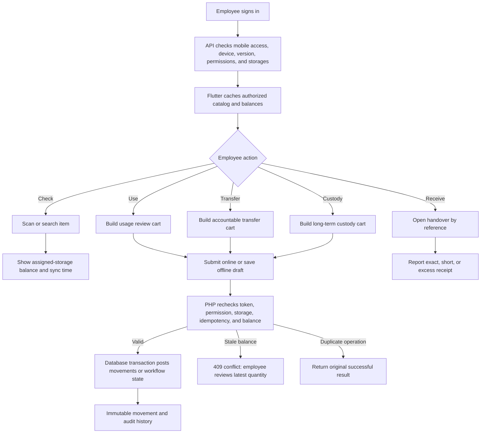

# Mobile Workflow Map

## Authority Boundary

The Flutter application is a field interface. The PHP application owns final permissions, balances, workflow transitions, proof storage, and audit history. No offline draft changes stock.
