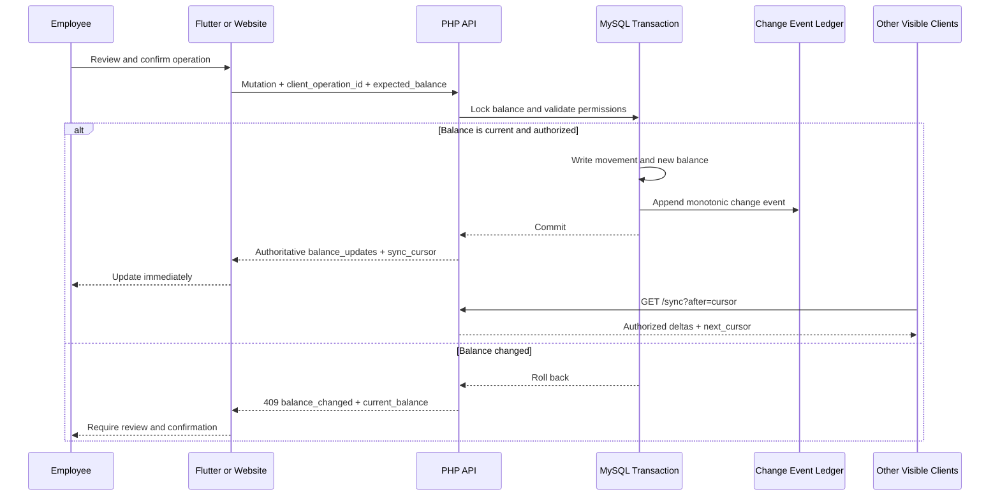
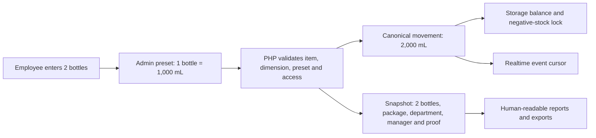

# Realtime Inventory Data Flow

Updated: 2026-08-22

Inventory KONA uses server-confirmed near-realtime synchronization. The PHP/MySQL application remains the only stock authority; phones and browser pages are projections of that state.

## Timing

- The employee who submits an action receives authoritative changed balances in the mutation response and updates immediately.
- Other visible Flutter clients and stock-sensitive website pages synchronize within five seconds.
- Background or hidden clients stop polling.
- Returning to the foreground triggers an immediate synchronization.

## Stock Mutation Flow

## Event Ledger

`inventory_change_events.id` is a monotonic cursor. Events are appended inside the same transaction as stock/workflow changes, so a committed movement cannot be missing its synchronization event.

`GET /api/v1/sync?after=<event_id>` returns:

- Changed authorized item payloads and assigned-storage balances.
- Archived/deleted item tombstones.
- Current permitted workflow tasks when workflow state changed.
- Effective permissions, capabilities, and assigned storage IDs.
- `next_cursor`, `latest_cursor`, `has_more`, and `access_fingerprint`.

The client keeps requesting pages while `has_more` is true. Events older than 90 days may be purged. An expired cursor returns `full_resync_required`; the client reloads `/bootstrap` instead of trying to reconstruct missing history.

## Access Changes

The access fingerprint changes when permissions, capabilities, storage scope, API enablement, or minimum-version rules change. Flutter reloads authorized bootstrap data on the next visible sync. Revoked devices, disabled employees, refresh reuse, unsupported versions, or disabled mobile access force logout or block the request server-side.

The client UI hiding an action is convenience, not security. Every API endpoint independently rechecks website permission, mobile capability, storage assignment, workflow relationship, device session, and current status.

## Idempotency And Conflicts

Every mutation includes a UUID `client_operation_id`. Replaying the same ID returns the original result and never posts stock twice. Batch operations are atomic.

Offline work remains a draft. On reconnect, the server compares `expected_balance` with the locked authoritative row. A mismatch returns `409 balance_changed` with the latest balance, and the employee must review before retrying.

## Reporting

Reports, exports, movement logs, and stock invariants query MySQL movements and storage balances. They never depend on Flutter cache state or whether a visible page has completed its latest poll.

## Measured Movement Flow

The client may preview the calculation, but only the server conversion is accepted. A disabled preset, preset from another item, incompatible dimension, stale balance, missing required proof, or revoked storage assignment rolls back the complete batch.
