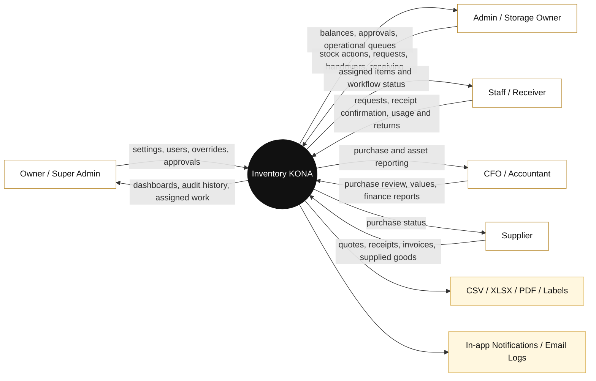
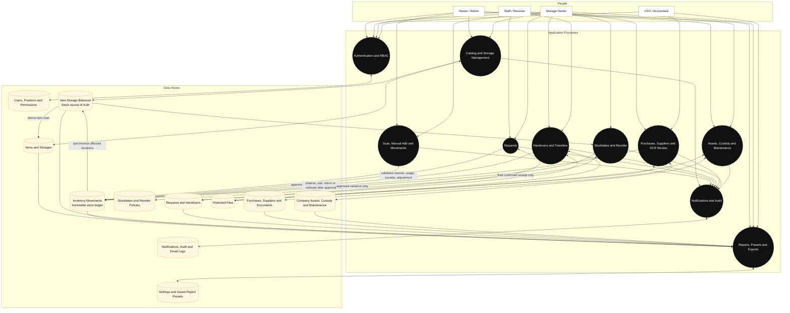
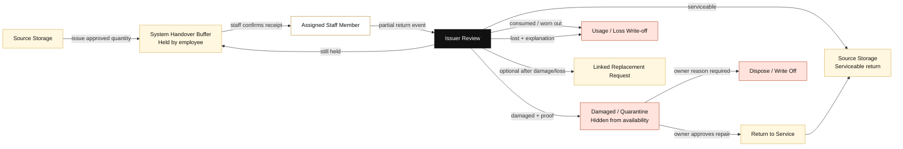

# Inventory KONA System Diagrams

Updated: 2026-07-28

These diagrams describe the current production architecture and business cycles. They are maintained as Mermaid so GitHub and compatible documentation tools can render them without storing another stale image.

## Data Flow Diagram: System Context

## Data Flow Diagram: Stock And Workflow Detail

### Stock Safety Rule

`item_storage_balances` is the stock source of truth. Every stock-changing workflow must create an immutable inventory movement and update the affected location balance in one validated operation. `items.current_quantity` is a synchronized catalog snapshot, not an independent stock ledger.

## Data Flow Diagram: Temporary Handover Reconciliation

```mermaid
flowchart LR
    SOURCE["Source Storage"]
    BUFFER["System Handover Buffer"]
    RECEIPT["Receiver Confirms Receipt"]
    RETURNS["Returned Quantity Per Item"]
    PHYSICAL["Physical Used\nReceived - Returned"]
    OPERATIONS["Operational Summary Per Unit\nOnline, Walk-in, Event, Sport,\nDamage, Complimentary, No Show, Other"]
    DIFFERENCE["Difference\nPhysical Used - Operational Used"]
    REVIEW["Issuer Final Review"]
    CLOSED["Usage And Return Movements\nClosed Handover"]

    SOURCE -->|"issued stock"| BUFFER
    BUFFER --> RECEIPT
    RECEIPT --> RETURNS
    RETURNS --> PHYSICAL
    PHYSICAL --> DIFFERENCE
    OPERATIONS --> DIFFERENCE
    DIFFERENCE -->|"zero: reconciled"| REVIEW
    DIFFERENCE -->|"positive: note + variance reason"| REVIEW
    DIFFERENCE -->|"negative: blocked"| OPERATIONS
    REVIEW -->|"approved values only"| CLOSED

    classDef storage fill:#fff7df,stroke:#d8ae52,color:#111;
    classDef person fill:#fff,stroke:#b8892d,color:#111;
    classDef control fill:#111,stroke:#111,color:#fff;
    classDef risk fill:#ffe3dc,stroke:#b9472c,color:#111;
    class SOURCE,BUFFER,CLOSED storage;
    class RECEIPT,RETURNS person;
    class PHYSICAL,OPERATIONS,REVIEW control;
    class DIFFERENCE risk;
```

`Operational Used = Online - No Show + Walk-in + Event + Sport + Damage + Complimentary + Other`.

New staff handovers use this handover-level summary. Exact SKU quantities still come from handover lines and inventory movements. Historical handovers keep their legacy per-item usage records.

## Data Flow Diagram: Long-Term Staff Custody

Custody is for interchangeable inventory such as brooms, uniforms, and cleaning tools. Fixed assets such as serialized laptops, cameras, and radios remain in the Assets module. A custody handover closes only after every confirmed unit is resolved as serviceable, damaged, consumed, lost, or otherwise returned.

## Use Case Diagram

```mermaid
flowchart LR
    OWNER["Owner / Super Admin"]
    STORAGE["Admin / Storage Owner"]
    STAFF["Staff / Receiver"]
    FINANCE["CFO / Accountant"]

    subgraph INVENTORY["Inventory Operations"]
        UC1(["Manage items, images, units and barcodes"])
        UC2(["Manage storages and location balances"])
        UC3(["Record restock, usage, transfer and adjustment"])
        UC4(["Scan or manually add stock"])
        UC5(["Run stocktake and reorder review"])
    end

    subgraph WORKFLOWS["Accountable Workflows"]
        UC6(["Request items"])
        UC7(["Approve or reject request"])
        UC8(["Issue handover to staff"])
        UC9(["Confirm receipt, return and actual usage"])
        UC10(["Approve final handover stock"])
        UC11(["Transfer stock to another storage owner"])
    end

    subgraph PROCUREMENT["Procurement And Control"]
        UC12(["Create supplier purchase draft"])
        UC13(["Review OCR and protected documents"])
        UC14(["Approve purchase and final receipt"])
        UC15(["Manage fixed assets and asset custody"])
        UC16(["Track maintenance, warranty and depreciation"])
        UC23(["Manage long-term inventory custody returns"])
        UC24(["Review quarantine, repair and disposal"])
    end

    subgraph ADMINISTRATION["Administration And Evidence"]
        UC17(["View dashboards and operational reports"])
        UC18(["Save report filters and export evidence"])
        UC19(["Manage users, roles and permissions"])
        UC20(["Configure site, email, OCR and export settings"])
        UC21(["Review notifications and audit history"])
        UC22(["Override or recover workflow status"])
    end

    OWNER --> UC1
    OWNER --> UC2
    OWNER --> UC3
    OWNER --> UC5
    OWNER --> UC7
    OWNER --> UC8
    OWNER --> UC10
    OWNER --> UC11
    OWNER --> UC14
    OWNER --> UC15
    OWNER --> UC16
    OWNER --> UC23
    OWNER --> UC24
    OWNER --> UC17
    OWNER --> UC18
    OWNER --> UC19
    OWNER --> UC20
    OWNER --> UC21
    OWNER --> UC22

    STORAGE --> UC1
    STORAGE --> UC2
    STORAGE --> UC3
    STORAGE --> UC4
    STORAGE --> UC5
    STORAGE --> UC7
    STORAGE --> UC8
    STORAGE --> UC10
    STORAGE --> UC11
    STORAGE --> UC12
    STORAGE --> UC13
    STORAGE --> UC15
    STORAGE --> UC23
    STORAGE --> UC17
    STORAGE --> UC18
    STORAGE --> UC21

    STAFF --> UC6
    STAFF --> UC9
    STAFF --> UC15
    STAFF --> UC23
    STAFF --> UC21

    FINANCE --> UC12
    FINANCE --> UC13
    FINANCE --> UC14
    FINANCE --> UC16
    FINANCE --> UC17
    FINANCE --> UC18
    FINANCE --> UC21

    classDef actor fill:#fff,stroke:#b8892d,color:#111,stroke-width:1px;
    classDef usecase fill:#fff7df,stroke:#d8ae52,color:#111;
    class OWNER,STORAGE,STAFF,FINANCE actor;
    class UC1,UC2,UC3,UC4,UC5,UC6,UC7,UC8,UC9,UC10,UC11,UC12,UC13,UC14,UC15,UC16,UC17,UC18,UC19,UC20,UC21,UC22,UC23,UC24 usecase;
```

## Workflow Ownership Summary

| Workflow | Initiates | Confirms or approves | Stock changes |
|---|---|---|---|
| Direct movement | Authorized owner/admin | Same authorized action | Immediately after validation |
| Staff request | Staff or admin | Source storage approver, then requester receipt | At the workflow's approved fulfillment points |
| Staff handover | Issuer/storage owner | Receiver confirms receipt, reports returns and operational totals; issuer reviews Difference and approves closeout | Reserved on issue; final use/return on issuer approval |
| Long-term staff custody | Issuer/storage owner | Assigned employee submits partial returns; source issuer approves each event | Reserved on issue; approved serviceable/damaged/consumed/lost outcomes post per event |
| Storage transfer handover | Source storage owner | Destination storage owner confirms receipt | Received quantity moves to destination; shortage returns to source |
| Purchase | Creator/operations | Approver, receiver, then final approver | Only after final receipt confirmation |
| Stocktake | Authorized counter | Approver | Only approved variance posts |
| Asset custody | Asset administrator | Recipient confirms receipt or return | No consumable inventory impact |
